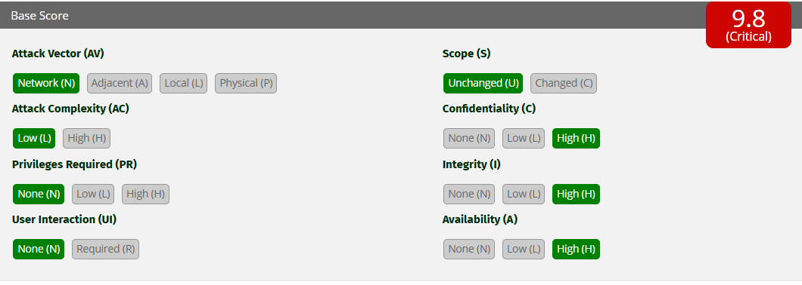

# Ataque 1 — Inyección SQL

## Evidencia

Ejecutado en DVWA (nivel Low), módulo **SQL Injection**. En el campo "User ID" se ingresó: ' OR '1'='1


*En la imagen se ingresa el payload `' OR '1'='1` en el campo User ID. En lugar
de un solo usuario, la aplicación devuelve la tabla completa (admin, Gordon
Brown, Hack Me, Pablo Picasso y Bob Smith), demostrando que se extrajo toda la
base con una única entrada manipulada.*

<!-- DEMO -->

## Por qué funciona

La aplicación arma la consulta concatenando el texto del usuario:

```sql
SELECT nombre FROM users WHERE id = '' OR '1'='1'
```

La comilla cierra el dato y `OR '1'='1'` agrega una condición siempre
verdadera, por lo que la base devuelve todas las filas. La causa raíz: la
aplicación mezcla datos del usuario con sus instrucciones, tratando como
código algo que debería ser solo dato.

## Gravedad (CVSS 3.1)

- **Puntaje: 9.8 — Crítica**
- **Vector: CVSS:3.1/AV:N/AC:L/PR:N/UI:N/S:U/C:H/I:H/A:H**



*Cálculo en la calculadora oficial CVSS 3.1 de FIRST: el vector mostrado arroja un puntaje base de 9.8 (Crítica).*

Cada métrica se marcó según lo observado en el ataque:

- **Attack Vector: Network (AV:N)** — el portal se ataca por internet, sin acceso físico ni local.
- **Attack Complexity: Low (AC:L)** — el payload `' OR '1'='1` funciona al primer intento, sin condiciones especiales.
- **Privileges Required: None (PR:N)** — no se necesita una cuenta ni permisos previos para enviarlo.
- **User Interaction: None (UI:N)** — el atacante lo ejecuta solo; ninguna víctima debe hacer nada.
- **Scope: Unchanged (S:U)** — el daño queda dentro del mismo componente: la base de datos del portal.
- **Confidencialidad, Integridad y Disponibilidad: High (C:H/I:H/A:H)** — permite leer, modificar y borrar toda la base de afiliados.

La combinación de máxima facilidad de explotación e impacto total en las tres dimensiones lleva el puntaje al rango crítico: **9.8**.

## Impacto para AFP Horizonte

La base del portal contiene RUT, fondos, datos laborales y renta de los
afiliados. Una inyección SQL exitosa expondría el ahorro previsional y la
información económica de todos los clientes, con consecuencias legales,
económicas y reputacionales para la AFP.

## Prevención (3.1.4)

Usar **consultas parametrizadas (prepared statements)** en todo acceso a la
base: el dato viaja separado de la instrucción y nunca se interpreta como
código. Complementar validando el tipo de entrada (ej. formato de RUT).

## Mitigación (3.1.5)

Desplegar un **WAF** que bloquee patrones de inyección y aplicar **mínimo
privilegio** en la cuenta de base de datos del portal (sin permisos para
borrar tablas), con monitoreo de consultas anómalas.

*Marco de referencia: NIST SP 800-53, control AC-6 (Least Privilege) para la cuenta de base de datos, y CIS Controls (Seguridad del Software de Aplicaciones) para el WAF y el monitoreo.*