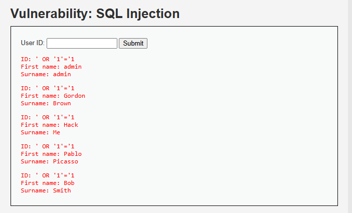

# Ataque 1 — Inyección SQL

## Evidencia

## Evidencia

Ejecutado en DVWA (nivel Low), módulo **SQL Injection**. En el campo "User ID" se ingresó: ' OR '1'='1



*En la imagen se ingresa el payload `' OR '1'='1` en el campo User ID. En lugar
de un solo usuario, la aplicación devuelve la tabla completa (admin, Gordon
Brown, Hack Me, Pablo Picasso y Bob Smith), demostrando que se extrajo toda la
base con una única entrada manipulada.*

## Por qué funciona

La aplicación arma la consulta concatenando el texto del usuario:

```sql
SELECT nombre FROM users WHERE id = '' OR '1'='1'
```

La comilla cierra el dato y `OR '1'='1'` agrega una condición siempre
verdadera, por lo que la base devuelve todas las filas. La causa raíz: la
aplicación mezcla datos del usuario con sus instrucciones, tratando como
código algo que debería ser solo dato.

## Gravedad (CVSS 3.1)

- **Puntaje: 9.8 — Crítica**
- **Vector: CVSS:3.1/AV:N/AC:L/PR:N/UI:N/S:U/C:H/I:H/A:H**

Se explota por red, sin privilegios ni interacción, con impacto alto en
confidencialidad, integridad y disponibilidad: permite leer, modificar y
borrar toda la base.

## Impacto para AFP Horizonte

La base del portal contiene RUT, fondos, datos laborales y renta de los
afiliados. Una inyección SQL exitosa expondría el ahorro previsional y la
información económica de todos los clientes, con consecuencias legales,
económicas y reputacionales para la AFP.

## Prevención (3.1.4)

Usar **consultas parametrizadas (prepared statements)** en todo acceso a la
base: el dato viaja separado de la instrucción y nunca se interpreta como
código. Complementar validando el tipo de entrada (ej. formato de RUT).

## Mitigación (3.1.5)

Desplegar un **WAF** que bloquee patrones de inyección y aplicar **mínimo
privilegio** en la cuenta de base de datos del portal (sin permisos para
borrar tablas), con monitoreo de consultas anómalas.