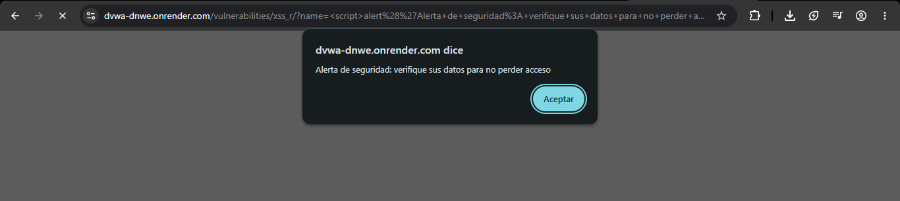
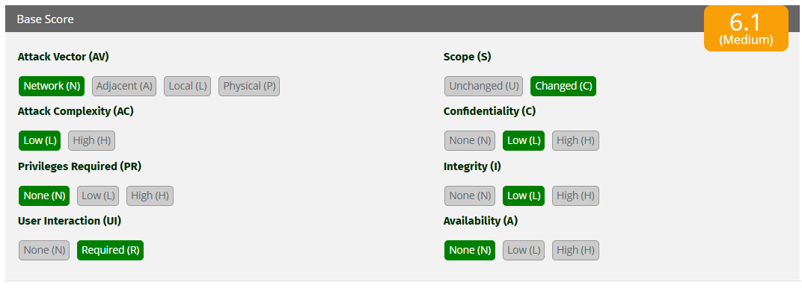

# Ataque 2 — XSS (Cross-Site Scripting)

## Evidencia

Ejecutado en DVWA (nivel Low), módulo **XSS (Reflected)**. En el campo "What's your name?" se ingresó:  <script>alert('Alerta de seguridad: verifique sus datos para no perder acceso')</script>




*En la imagen, la entrada se interpreta como código y el navegador ejecuta el script, mostrando un popup con el mensaje "Alerta de seguridad: verifique sus datos para no perder acceso". Este mensaje simula una alerta fraudulenta que suplanta a la AFP para inducir al afiliado a entregar sus credenciales. En la URL se observa el payload inyectado, confirmando que el código se reflejó y ejecutó.*

## Por qué funciona

La aplicación inserta la entrada del usuario dentro del HTML sin sanitizarla.
Una entrada normal:

```html
<p>Hola Profe Ruben</p>
```

Una entrada maliciosa con una etiqueta script:

```html
<p>Hola <script>alert('Alerta de seguridad: verifique sus datos para no perder acceso')</script></p>
```

El navegador no distingue entre el contenido propio de la página y la entrada
del usuario, por lo que ejecuta el script. La causa raíz es la misma que en la
inyección SQL: la aplicación mezcla datos del usuario con su propio código.

## Gravedad (CVSS 3.1)

- **Puntaje: 6.1 — Media**
- **Vector: CVSS:3.1/AV:N/AC:L/PR:N/UI:R/S:C/C:L/I:L/A:N**



*Cálculo en la calculadora oficial CVSS 3.1 de FIRST: el vector mostrado arroja un puntaje base de 6.1 (Media).*

Cada métrica se marcó según lo observado en el ataque:

- **Attack Vector: Network (AV:N)** — el ataque viaja por internet, en un enlace con el payload.
- **Attack Complexity: Low (AC:L)** — el payload `<script>alert('Alerta de seguridad: verifique sus datos para no perder acceso')</script>` se ejecuta sin condiciones especiales.
- **Privileges Required: None (PR:N)** — no se necesita cuenta para enviarlo.
- **User Interaction: Required (UI:R)** — la víctima debe abrir el enlace para que el script corra. Este paso intermedio es lo que baja el puntaje frente a SQLi y comandos.
- **Scope: Changed (S:C)** — el código se ejecuta en el navegador de la víctima, un componente distinto del servidor que reflejó la entrada; por eso el alcance cambia.
- **Confidencialidad e Integridad: Low (C:L/I:L)** — puede robar la sesión o datos visibles, pero el acceso es parcial: no expone toda la base.
- **Disponibilidad: None (A:N)** — no deja el servicio fuera de línea.

La interacción requerida y el impacto parcial dejan el puntaje en el rango medio: **6.1**.

## Impacto para AFP Horizonte

Mediante XSS, un atacante puede robar la sesión de un afiliado, redirigirlo a
un sitio falso o presentarle un formulario fraudulento que imite el portal.
Esto permitiría suplantar al afiliado y acceder a sus datos previsionales o
capturar sus credenciales de acceso.

## Prevención (3.1.4)

**Escapar la salida**: convertir caracteres como `<` en `&lt;` para que la
entrada del usuario se muestre como texto y nunca se interprete como código.
Validar y sanitizar toda entrada que luego se muestre en pantalla.

## Mitigación (3.1.5)

Aplicar una **política CSP (Content Security Policy)** que limite qué scripts
puede ejecutar el navegador, bloqueando los inyectados. Complementar con el
uso de cookies de sesión con atributos `HttpOnly` y `Secure` para dificultar
el robo de sesión.