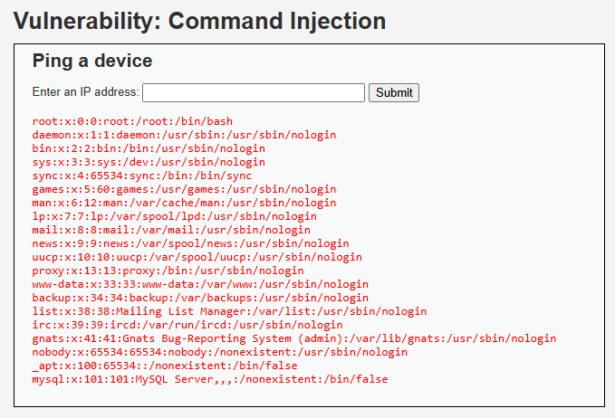
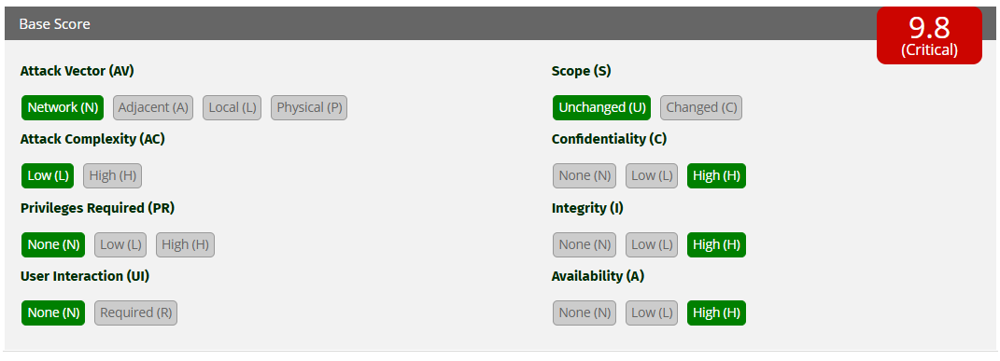

# Ataque 3 — Inyección de comandos
## Evidencia

Ejecutado en DVWA (nivel Low), módulo **Command Injection**. En el campo "Enter an IP address" se ingresó: 127.0.0.1; cat /etc/passwd

*En la imagen, además del resultado del ping a 127.0.0.1, el servidor muestra
el contenido de /etc/passwd, listando las cuentas de usuario del sistema. Esto
confirma que se ejecutó un comando del sistema operativo a través del campo.*

<!-- DEMO -->

## Por qué funciona

La aplicación arma un comando del sistema usando la entrada del usuario: ping -c 4 127.0.0.1
Al ingresar `127.0.0.1; cat /etc/passwd`, el comando queda: ping -c 4 127.0.0.1; cat /etc/passwd

El carácter `;` encadena dos comandos: el servidor ejecuta el ping y, a
continuación, lee el archivo. La causa raíz es que la aplicación pasa la
entrada del usuario directamente al sistema operativo, tratándola como
instrucción en lugar de como dato.

## Gravedad (CVSS 3.1)

- **Puntaje: 9.8 — Crítica**
- **Vector: CVSS:3.1/AV:N/AC:L/PR:N/UI:N/S:U/C:H/I:H/A:H**

*Cálculo en la calculadora oficial CVSS 3.1 de FIRST: el vector mostrado arroja un puntaje base de 9.8 (Crítica).*

Cada métrica se marcó según lo observado en el ataque:

- **Attack Vector: Network (AV:N)** — el comando se inyecta por internet a través del campo del portal.
- **Attack Complexity: Low (AC:L)** — el payload `127.0.0.1; cat /etc/passwd` se ejecuta directo, sin condiciones especiales.
- **Privileges Required: None (PR:N)** — no se requiere cuenta ni permisos previos.
- **User Interaction: None (UI:N)** — el atacante lo ejecuta solo; ninguna víctima participa.
- **Scope: Unchanged (S:U)** — el ataque y su impacto ocurren en el mismo servidor del portal.
- **Confidencialidad, Integridad y Disponibilidad: High (C:H/I:H/A:H)** — permite leer, modificar y borrar archivos, instalar software o dejar el servicio fuera de línea: equivale a controlar el servidor.

Por esa facilidad de explotación e impacto total sobre el servidor, el puntaje llega al rango crítico: **9.8**.

## Impacto para AFP Horizonte

Controlar el servidor del portal le daría al atacante acceso a toda la
infraestructura de AFP Horizonte: podría leer la base de datos de afiliados,
robar credenciales, instalar software malicioso o dejar el portal fuera de
servicio. Es el escenario más grave para la continuidad del negocio.

## Prevención (3.1.4)

**Nunca pasar la entrada del usuario directamente al sistema operativo.** Usar
listas blancas que acepten solo valores con formato válido (por ejemplo, solo
una IP) y APIs seguras que no invoquen la terminal del sistema.

## Mitigación (3.1.5)

Ejecutar la aplicación con **privilegios mínimos** para que, aun si se explota,
el atacante no pueda acceder a archivos críticos. Complementar con un **WAF** y
monitoreo que detecte comandos del sistema en las entradas.

*Marco de referencia: NIST SP 800-53, control AC-6 (Least Privilege) para la ejecución con privilegios mínimos, y CIS Controls para el WAF y el monitoreo de comandos.*

## Resumen CVSS de los tres ataques

| Ataque | Puntaje CVSS | Severidad |
|--------|--------------|-----------|
| Inyección SQL | 9.8 | Crítica |
| Inyección de comandos | 9.8 | Crítica |
| XSS (Reflected) | 6.1 | Media |

Los tres se evalúan en la escala CVSS 3.1 (0 a 10). La inyección SQL y la de comandos alcanzan severidad crítica por su impacto total sobre la base de datos y el servidor; el XSS es de severidad media por requerir interacción de la víctima y tener un impacto más acotado.