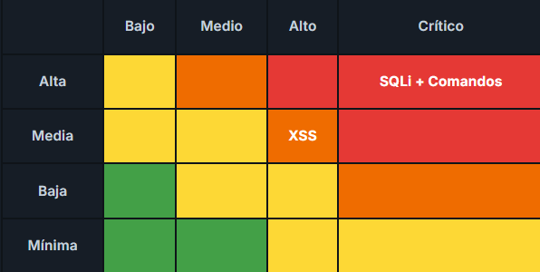

# Matriz de riesgo

El riesgo se calcula como probabilidad × impacto. La probabilidad indica qué tan fácil o frecuente es que la vulnerabilidad se explote (se estima a partir del CVSS), y el impacto indica cuánto daña al negocio según el activo afectado. En AFP Horizonte, los impactos son altos porque los activos involucran ahorro previsional e información económica protegida por ley.

## Ubicación de cada hallazgo

**Inyección SQL — Probabilidad Alta, Impacto Crítico.** Con CVSS 9.8, es trivial de explotar y no requiere privilegios ni interacción. Afecta la base de datos de afiliados, exponiendo RUT, renta y datos laborales de todos los clientes. Riesgo crítico.

**Inyección de comandos — Probabilidad Alta, Impacto Crítico.** Con CVSS 9.8, también es trivial de explotar y otorga control del servidor, el activo que sostiene todo el portal. Compromete la continuidad del negocio. Riesgo crítico.

**XSS — Probabilidad Media, Impacto Alto.** Con CVSS 6.1, requiere que la víctima abra el enlace con el payload, lo que reduce su probabilidad. Afecta las credenciales de acceso, permitiendo robo de sesión y suplantación de afiliados. Riesgo alto.

## Mapa de calor

El siguiente mapa de calor cruza la probabilidad y el impacto de cada hallazgo. Las celdas rojas representan los riesgos que deben atenderse primero; las verdes, los que pueden esperar.

*El mapa de calor ubica la inyección SQL y la inyección de comandos en la zona crítica (probabilidad alta, impacto crítico) y el XSS en la zona de riesgo alto (probabilidad media, impacto alto).*

## Priorización

Ordenados de mayor a menor riesgo, la prioridad de remediación es: (1) inyección SQL e inyección de comandos, ambas críticas y de atención inmediata; (2) XSS, de riesgo alto. Esta priorización guía el orden en que se aplican los controles del siguiente apartado.